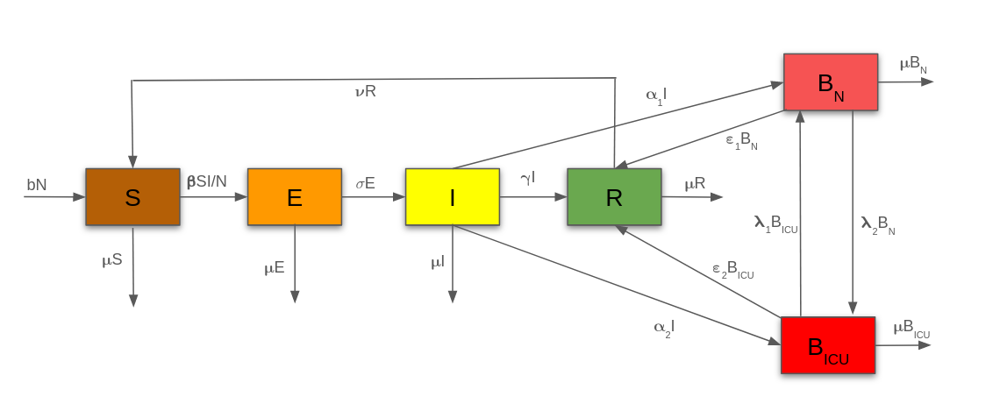

# COVID-19-Making-Decision

## Members

- Annette Diffo
- Jay 
- Oumarou BOLA
- Shama Wache 
- T
- Yvan CARRE

## Research Question

What is the impact if the timing of non-pharmaceutical Intervention (NPIs) on the hospitalisation bed capacity for COVID-19 outbreaking : Berlin?

## Model

  

