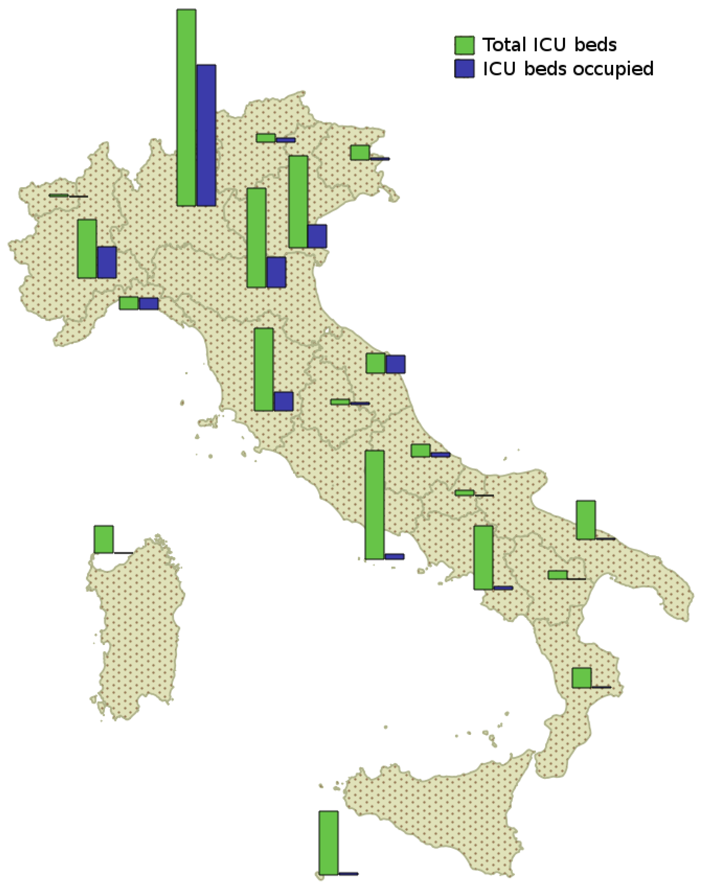
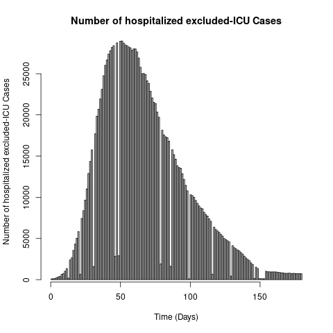
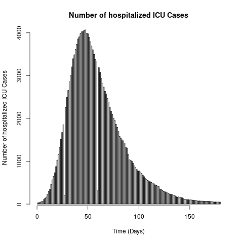

# COVID-19-Making-Decision


## Team Members

Annette  -  Emmanuel A. - Jay - Oumarou  - Shama - Tiwonge - Yvan 

## Title

The Impact of Timing of Non-Pharmaceutical Interventions (NPIs) on ICU Beds Occupancy During the 2020 COVID-19 Outbreak in Italy

<p align="center">
  
</p>

## Objective

Our goal in this project is to advise Italian policymakers on the optimal timeline for interventions to prevent hospital
overcrowding, protect citizens by curbing the virus’s spread at the right time, and reduce public health costs for the government.

## Research Question
How does implementation of non-pharmaceutical interventions on days 5, 10, 30, and 50 after the first detected case of SARS-CoV-2 in Italy affect ICU bed occupancy?

## Dataset Description

The dataset containing historical data on COVID-19 cases, hospitalizations, and hospital bed occupancy has been sourced from the Italian National Institute of Health. Our dataset, named `hospitalization.csv`, includes 150 rows and 4 columns. Each row corresponds to a specific day starting from *February 24, 2020* and includes the following columns:

- **Time**: The date of the recorded data (daily).
- **Excluded_ICU_cases**: The number of patients hospitalized in normal beds (non-ICU).
- **ICU_cases**: The number of patients hospitalized in ICU beds.
- **Total_cases**: The total number of hospitalized patients, combining both normal bed and ICU bed hospitalizations.


<p align="center">
  
  
</p>

## Model

The stochastic SEIR model will be implemented using historical data from Milan's COVID-19 outbreak. The parameters ($\beta$, $\sigma$, $\alpha$, $\theta$, $\gamma_1$, $\lambda_1$, $\delta$)


The model will simulate the progression of the pandemic over 150 days for the first wave, analyzing the impact of different non-pharmaceutical interventions (NPIs) on hospital bed capacity.


## SEIR Model for Milan's COVID-19 Outbreak

### Model Diagram

<!--  -->

<p align="center">
  
</p>


### States - Parameters

## SEIR Model States and Parameters

### States

<p align="center">
| **Symbol** | **Description**                                      |
|------------|------------------------------------------------------|
| $S$        | Number of susceptible individuals                    |
| $E$        | Number of exposed individuals                        |
| $I$        | Number of infectious individuals                     |
| $B_N$      | Number of non-ICU hospitalized individuals           |
| $B_{ICU}$  | Number of ICU hospitalized individuals               |
</p>

### Parameters

<p align="center">
| **Symbol** | **Description**                                       |
|------------|-------------------------------------------------------|
| $N$        | Total population                                      |
| $\beta$    | Transmission rate                                     |
| $\sigma$   | Rate at which exposed individuals become infectious   |
| $\alpha$   | Rate at which infectious individuals are hospitalized |
| $\theta$   | Rate at which non-ICU hospitalized individuals recover |
| $\gamma_1$ | Rate at which non-ICU hospitalized individuals move to ICU |
| $\lambda_1$| Rate at which ICU individuals recover                 |
| $\delta$   | Death rate in the ICU                                 |
</p>
<!-- States:
- $S$ is the number of susceptible individuals
- $E$ is the number of exposed individuals
- $I$ is the number of infectious individuals
- $B_N$ is the number of non-ICU hospitalized individuals
- $B_{ICU}$ is the number of ICU hospitalized individuals

Parameters:
- $N$ is the total population
- $\beta$: Transmission rate
- $\sigma$: Rate at which exposed individuals become infectious
- $\alpha$: Rate at which infectious individuals are hospitalized
- $\theta$: Rate at which non-ICU hospitalized individuals recover
- $\gamma_1$: Rate at which non-ICU hospitalized individuals are moved to the ICU
- $\lambda_1$: Rate at which ICU individuals recover
- $\delta$: Death rate in the ICU -->


### Differential Equations

The model is governed by the following system of differential equations:

$$
\begin{align*}
\frac{dS}{dt} &= -\beta \frac{SI}{N} \\
\frac{dE}{dt} &= \beta \frac{SI}{N} - \sigma E \\
\frac{dI}{dt} &= \sigma E - \alpha I \\
\frac{dB_N}{dt} &= \alpha I - (\theta + \gamma_1) B_N \\
\frac{dB_{ICU}}{dt} &= \gamma_1 B_N - (\lambda_1 + \delta) B_{ICU}
\end{align*}
$$


## Usage

To run the model, follow these steps:

1. Clone the repository:
    ```bash
    git clone https://github.com/Vilmo18/COVID-19-Making-Decision
    ```
2. Navigate to the project directory:
    ```bash
    cd SEIR-Milan-COVID19
    ```

## Analysis

The simulation will provide insights into the impact of various NPIs on hospital bed capacity. Results will be visualized to show the progression of the pandemic under different scenarios.

## Contributing

If you would like to contribute to this project, please fork the repository and create a pull request with your changes.

## License

This project is licensed under the MIT License 


