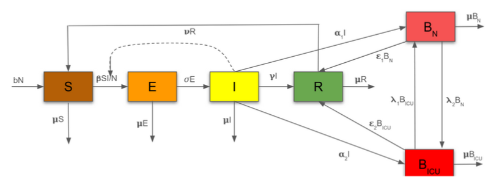

# COVID-19-Making-Decision

## Members

- Annette 
- Emmanuel A.
- Jay 
- Oumarou 
- Shama  
- Tiwonge
- Yvan 

## Title
The impact on the timing of non-pharmacotical interventions(NPI) on the hospital’s bed capacity for Covid-19 outbreak in Italy 2020
## Model

  

